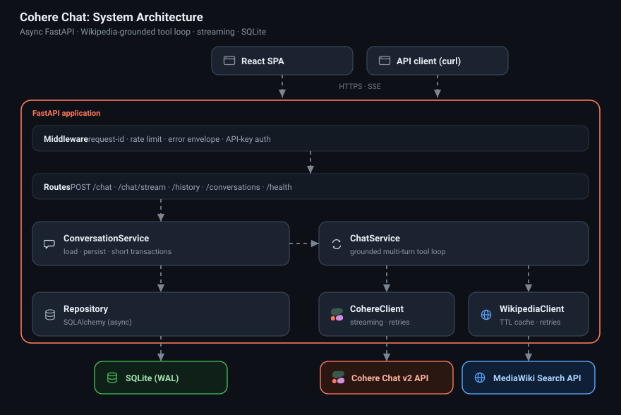

# Cohere Chat App

A Python service around the Cohere Chat (v2) API: chat with the model, ground
answers in live Wikipedia through tool calling (buffered or streamed), and
review conversation history. Fully async FastAPI backend, a React frontend, and
a test suite that runs offline with no API key.

The sections below answer the four questions from the assignment.

## Demo

https://github.com/user-attachments/assets/6c51aeeb-4a85-4262-a52e-04a2f41e5765


## 1. Getting started

Requires Python 3.10 or newer (tested on 3.12); the frontend needs Node 20+.

```bash
# Backend
python -m venv .venv && source .venv/bin/activate
pip install -e ".[dev]"
cp .env.example .env            # then set COHERE_API_KEY in .env
uvicorn app.main:app --reload
```

`COHERE_API_KEY` is required (create one at
https://dashboard.cohere.com/api-keys); the app fails fast at startup without it.

```bash
# Try it
curl -X POST http://127.0.0.1:8000/chat -H "Content-Type: application/json" \
  -d '{"query": "Who was the second person to walk on the moon?"}'
```

```bash
# Frontend (separate terminal); the dev server proxies the API, so no CORS setup
cd frontend && npm install && npm run dev
```

```bash
# Quality gates (also run in CI on every push)
ruff check . && ruff format --check .   # lint + format
mypy                                     # type-check
pytest                                   # 58 tests, offline, no key needed
```

Docker (backend): `docker build -t cohere-chat .` then
`docker run -e COHERE_API_KEY=your-key -p 8000:8000 cohere-chat`.

| Method | Path                  | Description                                             |
| ------ | --------------------- | ------------------------------------------------------ |
| GET    | `/health`             | Liveness probe.                                        |
| POST   | `/chat`               | Grounded answer within a conversation (JSON response). |
| POST   | `/chat/stream`        | The same, streamed as server-sent events.              |
| GET    | `/history`            | Paginated history of conversations and their turns.    |
| GET    | `/conversations/{id}` | One conversation with its turns and rich record.       |

`POST /chat` accepts an optional `conversation_id` to continue a conversation.
All settings are environment variables (see [.env.example](.env.example));
`API_KEYS` and `RATE_LIMIT_PER_MINUTE` turn on auth and rate limiting, both off
by default.

## 2. Design decisions and limitations



**How it works.** `POST /chat` and `/chat/stream` run a tool loop: the model is
offered a `search_wikipedia` tool; when it calls it, the service queries
MediaWiki, feeds the results back as Cohere document blocks, and calls the model
again until it answers. The document blocks are what produce inline citations.
The streaming endpoint emits the same flow as server-sent events (a tool-call
status, then answer tokens, then a final event with sources and citations).

**Key decisions.**

- **Async end to end** (FastAPI, Cohere `AsyncClientV2`, httpx, async
  SQLAlchemy); the work is I/O bound on three external systems.
- **Provider detail is isolated.** The app speaks small neutral types
  (`ChatMessage`, `ChatResult`) and never imports the SDK directly, so the
  provider is swappable and call sites are trivial to mock.
- **One model-call path.** `chat_stream` is the only call into the SDK; the
  buffered `/chat` drains it too, so streaming and non-streaming share a single
  tool loop. Stream retries cover establishment only, since a partly consumed
  stream cannot be safely replayed.
- **Multi-turn by replay**, windowed to the most recent messages to bound prompt
  size, and starting from a user turn.
- **Persistence stays off the slow path.** History is read in one short
  transaction and the new turn written in another; neither spans the model call,
  so a database connection is never held during it.
- **Resilient and predictable.** Shared exponential backoff with jitter,
  per-call timeouts, transient-only retries, graceful degradation when Wikipedia
  fails, and one consistent error envelope (`{error_code, detail}`).
- **Structured observability.** JSON logs with a request-id stamped on every line
  (and returned in `X-Request-ID`), plus per-call latency, token, and tool-call
  fields.
- **Optional security**, off by default: API-key auth, per-owner history
  isolation, and in-process rate limiting.

**Layout** (dependencies flow one way: `api -> services -> clients/db -> core`):

```
app/  main.py
  api/        routes/ (chat, history, health) + dependencies
  services/   chat (tool loop) + conversation (persistence)
  clients/    cohere + wikipedia
  db/         engine + models + repository
  core/       config, logging, exceptions, resilience, cache, middleware, rate_limit, auth
  schemas/    request/response and streaming models
```

A conversation is an ordered list of messages; the user and assistant turns are
the replay store, while the rich per-turn record (tokens, latency, sources,
citations) rides on the assistant message and is what the history endpoints
surface.

**Limitations.**

- Context is windowed by message count, not a token budget, and older turns are
  dropped rather than summarized.
- The within-turn tool-call and tool-result messages are not persisted, so a
  follow-up that references the search itself ("show me the third article you
  found") cannot be answered.
- The cache and rate limiter live in process, correct for one instance but not
  across workers or replicas; SQLite is single-writer (WAL is enabled so reads do
  not block writes).
- Auth is a shared-secret API key, not full identity, with no per-user quotas.
- **Wikipedia tool results are third-party content fed to the model, an inherent
  prompt-injection surface.** Tool-using models apply different trust to content
  depending on its channel (a user message versus a tool output), so a crafted
  Wikipedia snippet is a real risk. This is the focus of my recent work: Syed and
  Yasaei, "Same Payload, Different Channel: Measuring Trust Asymmetry in
  Tool-Using Language Models"
  ([arXiv:2606.00566](https://arxiv.org/abs/2606.00566)). Mitigations are in
  section 3.
- The schema is created on startup rather than managed by migrations.

## 3. What I would change before exposing this to customers

- **Datastore.** Postgres (a one-line `DATABASE_URL` change) with Alembic
  migrations and tuned connection pooling.
- **Shared state.** Replace the in-process cache and rate limiter with Redis so
  they are correct across replicas.
- **Identity.** OAuth or JWT with scopes, plus per-user quotas and token budgets.
- **Context management.** A token-budgeted window with summarization of older
  turns instead of message-count truncation.
- **Safety.** Treat tool output and user input as untrusted: content moderation,
  prompt-injection defenses, and isolating tool results from instruction
  following, informed by the channel-asymmetry finding above.
- **Secrets and config** through a secrets manager rather than `.env`.
- **Operations.** Ship the structured logs to a platform, add metrics and
  distributed tracing (OpenTelemetry), alert on latency, error rate, and token
  spend, and split liveness from readiness.
- **Delivery.** A pinned dependency lockfile and load testing. CI, type checking,
  a container image, and the streaming UI are already in place.

A natural ML next step for grounding quality is two-stage retrieval: fetch full
Wikipedia extracts, chunk them, and re-rank with Cohere Rerank, rather than
relying on the search snippets.

## 4. Tools and resources used

- **Cohere** Chat v2 API and the official `cohere` Python SDK; the Cohere docs
  for tool calling and citations.
- **Wikipedia** via the MediaWiki search API.
- **Backend:** FastAPI, Uvicorn, SQLAlchemy 2.0 (async) with aiosqlite, Pydantic
  and pydantic-settings, httpx, tenacity. **Frontend:** React, TypeScript, Vite,
  Tailwind CSS.
- **Tooling:** ruff, mypy, pytest, Docker, GitHub Actions.
- **Claude Sonnet 4.6** (Anthropic), used as a programming assistant for the React
  frontend and for code review.
